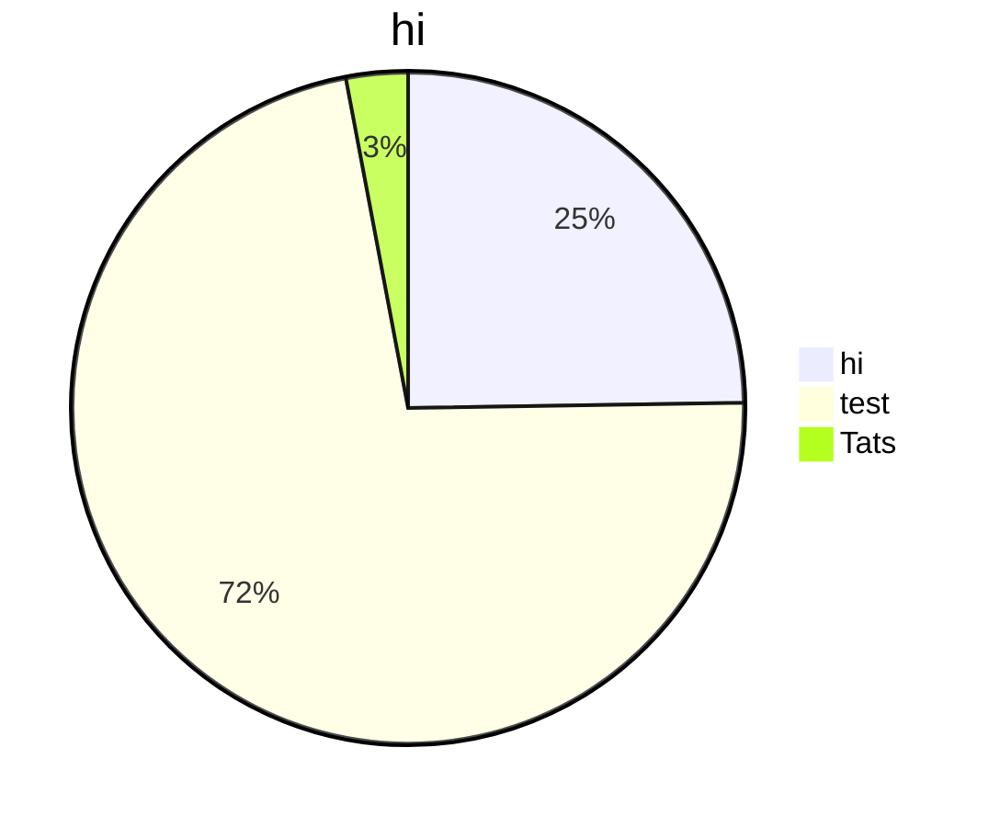

## 03 다항회귀
```python
#train data/test data 나누기
train_poly = np.column_stack((train_input ** 2, train_input))
test_poly = np.column_stack((test_input ** 2, test_input))

# 선형회귀모델
lr = LinearRegression()
lr.fit(train_poly, train_target)

print(lr.coef_, lr.intercept)
```


coef : 기울기    
intercept : 절편


```python
# 구간별 직선을 그리기 위해 15에서 49까지 정수 배열을 만듭니다
point = np.arange(15, 50)
# 훈련 세트의 산점도를 그립니다
plt.scatter(train_input, train_target)
# 15에서 49까지 2차 방정식 그래프를 그립니다
plt.plot(point, lr.coef_[0]*point**2 +lr.coef_[1]*point + lr.intercept_)
```


feature engineering (특성공학)
농어길이 x 농어 높이 라는 새로운 특성을 만드는것.



